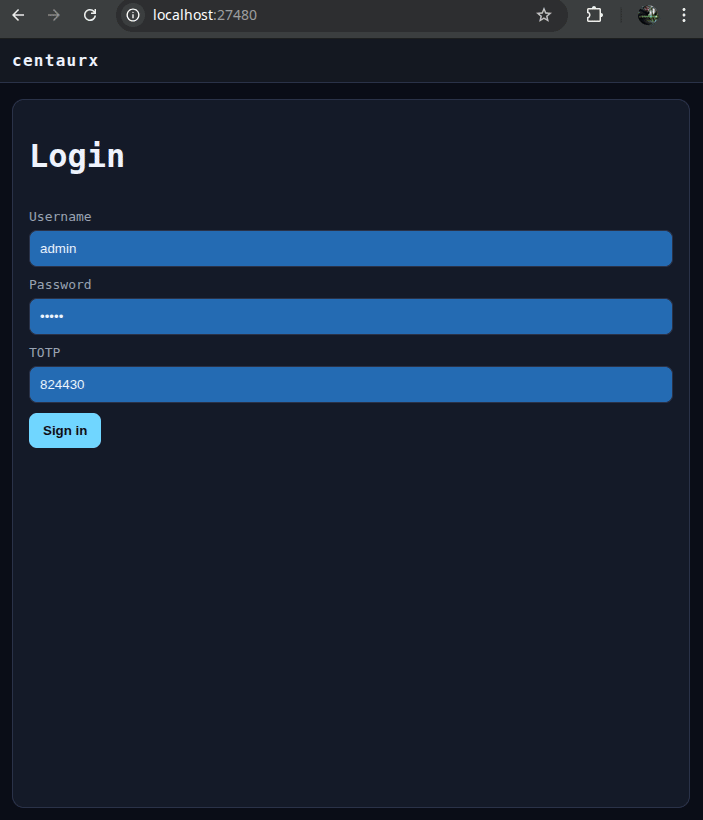
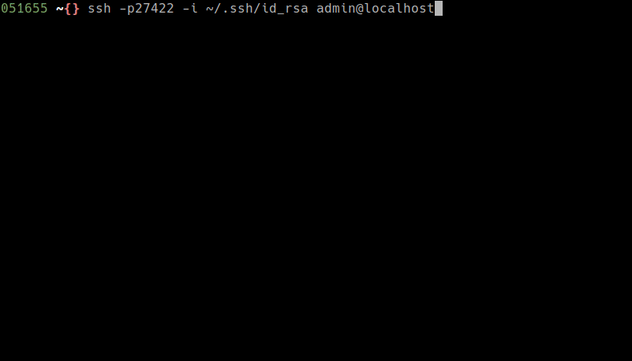
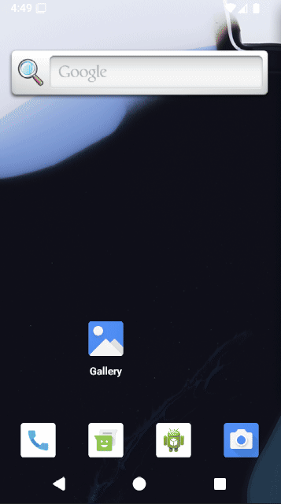

# Centaurx


`centaurx` is a self-hosted coding environment built around [Codex](https://openai.com/codex/) that unifies a
browser UI, an SSH TUI, and a native Android app behind the same session model.
It streams execution output in real time, keeps per-user workspaces and history
on disk, and uses a containerized runner for isolation while still feeling like
one coherent system across devices.
For a technical deep dive, see [`ARCHITECTURE.md`](ARCHITECTURE.md).

## Frontends

### Web UI
The web UI is the primary interface for interactive work. It provides a terminal
experience with tabs, streaming output, and the same slash-command workflow as
other clients, while keeping authentication and endpoint configuration simple.



### SSH TUI
The SSH TUI is designed for low-latency, keyboard-first workflows and remote
sessions. It mirrors the web UI command set and supports pasting Codex auth
payloads directly in the terminal when needed.



### Android app
The Android app is a native companion that mirrors the web UI layout and command
flow, with endpoint selection and persistent session cookies so you can stay
logged in across restarts. It uses the same backend and can target a local
backend via emulator host routing.



## Backend and runner
Centaurx exposes an HTTP API for the web UI and Android app and an SSH server for
the TUI, all backed by the same session store and per-user state. Output is
streamed via SSE, and commands operate on per-user workspaces with history and
buffers preserved across sessions. The runner executes work in an isolated
container that mounts each user’s home directory, including their per-user
Codex configuration.

Default ports are `:27480` for the HTTP UI/API and `:27422` for the SSH TUI.

Runner containers are per-user by default. Set `runner.container_scope: tab` to
isolate each tab in its own container. Resource limits and niceness are
configurable:

```yaml
runner:
  container_scope: user
  limits:
    cpu_percent: 70
    memory_percent: 70
  exec_nice: 10
  command_nice: 5
```

## Containerization
Podman is the only fully supported container engine for Centaurx. The bootstrap
flow generates Containerfiles plus a Podman Kubernetes YAML (`podman.yaml`) for
running the server and runner together. The runner image installs Codex and
build tools, while the server image handles sessions, API, UI assets, and
orchestration. Containerd rootless is not supported today. Docker Compose can be
used with Podman, but the Podman-native compose wrapper is not supported here;
the recommended path is `podman play kube` with `podman.yaml`.

## Installation

### Build
```bash
CGO_ENABLED=0 go build -o bin/centaurx ./cmd/centaurx
```

### Bootstrap
```bash
./bin/centaurx bootstrap
```

Bootstrap outputs (default):
- Host config: `~/.centaurx/config.yaml`
- Container bundle under `~/.centaurx/`:
  - `config-for-container.yaml`
  - `podman.yaml` (recommended)
  - `docker-compose.yaml` (generated; use with standard docker-compose if needed)
  - `Containerfile.centaurx` (server)
  - `Containerfile.cxrunner` (runner)
  - `.env` (UID/GID)
  - `files/cxrunner-install.sh`
  - `files/skel/`

### Run locally (host)
The server depends on a runner container image. Build the runner image first,
then start the server.

```bash
./bin/centaurx build runner
./bin/centaurx serve
```

### Run via containers (Podman)
```bash
centaurx build all
podman play kube podman.yaml
```

### HTTP base URL/path (optional)
If you need to serve the UI/API under a path prefix (for example behind a reverse
proxy), configure `http.base_path`. The server will only serve under that prefix
when it is set.

```yaml
http:
  base_url: ""        # optional, must include scheme + host if set
  base_path: "/cx"    # optional path prefix (no scheme, no query/fragment)
```

### Version
```bash
centaurx version
```

Notes:
- `go build` embeds VCS metadata by default, so `centaurx version` shows tags.
- `go run` requires `-buildvcs=true` (or `GOFLAGS=-buildvcs=true`) to show tags.
